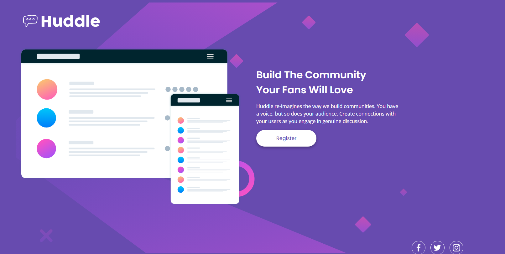

# Hunddle Landing Page

  
*[Demo ao Vivo](https://cadanieldev.github.io/huddle-landing.page/) | [Desafio Frontend Mentor](https://www.frontendmentor.io/challenges/huddle-landing-page-with-a-single-introductory-section-B_2Wvxgi0)*

## 📝 Visão Geral  
Página de destino responsiva para a Huddle, construída com HTML e CSS. Este projeto foi um desafio do Frontend Mentor focado em:
- HTML5 semântico
- CSS Grid e Flexbox
- Fluxo de trabalho mobile-first
- Posicionamento de imagens de fundo
- Design responsivo (1440px → 320px)

## 🛠 Tecnologias Utilizadas  
- HTML5
- CSS3 (Variáveis, Grid, Flexbox)
- Imagens responsivas
- Media Queries

## ✨ Funcionalidades  
- Layout adaptável para desktop e mobile
- Efeitos hover interativos
- Imagem de fundo que se ajusta em diferentes telas
- Otimização para dispositivos móveis

## 📱 Responsividade  
| Desktop (1440px) | Mobile (375px) |
|------------------|----------------|
|  |  |

## 🔧 Como Executar  
1. Clone o repositório:
```bash
git clone https://github.com/seu-usuario/huddle-landing-page.git
```
2. Abra o arquivo `index.html` no navegador

## 📚 Aprendizados  
- Técnicas avançadas de posicionamento com CSS Grid
- Gerenciamento de imagens de fundo em diferentes resoluções
- Melhores práticas de responsividade

## 🌟 Desafios e Soluções  
| Desafio | Solução Implementada |
|---------|----------------------|
| Alinhamento da logo em mobile | Reestruturação do grid e ajuste de margens |
| Posicionamento da imagem de fundo | Uso de `background-position: 40% center` |
| Adaptação do layout para telas pequenas | Media queries com breakpoints específicos |
